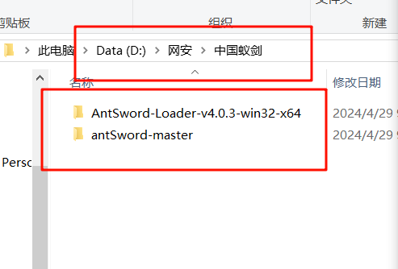
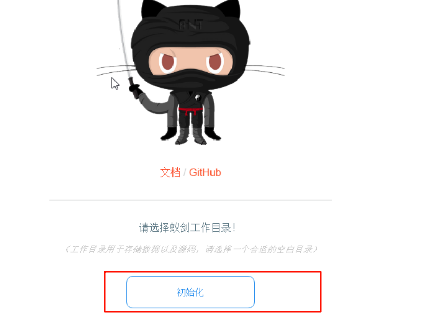
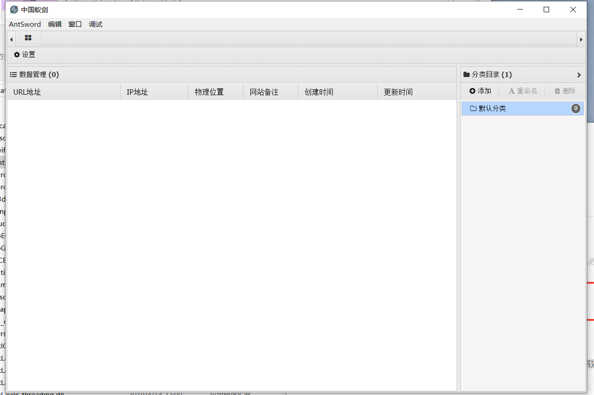

# 中国蚁剑(antSword)下载、安装、使用教程

## 下载地址

需要两个包

一个是项目核心源码”antSword“

https://github.com/AntSwordProject/antSword

一个是加载器

https://github.com/AntSwordProject/AntSword-Loader

## 安装

用下载的**AntSword-Loader-v4.0.3-win32-x64.zip** 以Windows版本64位来示例

解压

1.启动**AntSword-Loader-v4.0.3-win32-x64** 下的 AntSword.exe

2.点击初始化

3.选择下载的源码文件夹 **antSword-master**

>   如果只下载了加载器，选择一个空文件夹，加载器会自动帮你下载核心项目源码

4.等初始化完成后，重启“AntSword.exe”即可正常启动！

.

## 使用

如何使用参考博客   http://t.csdnimg.cn/6raT1

